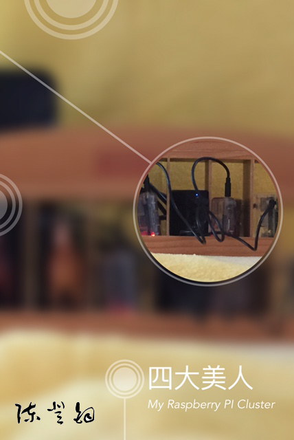
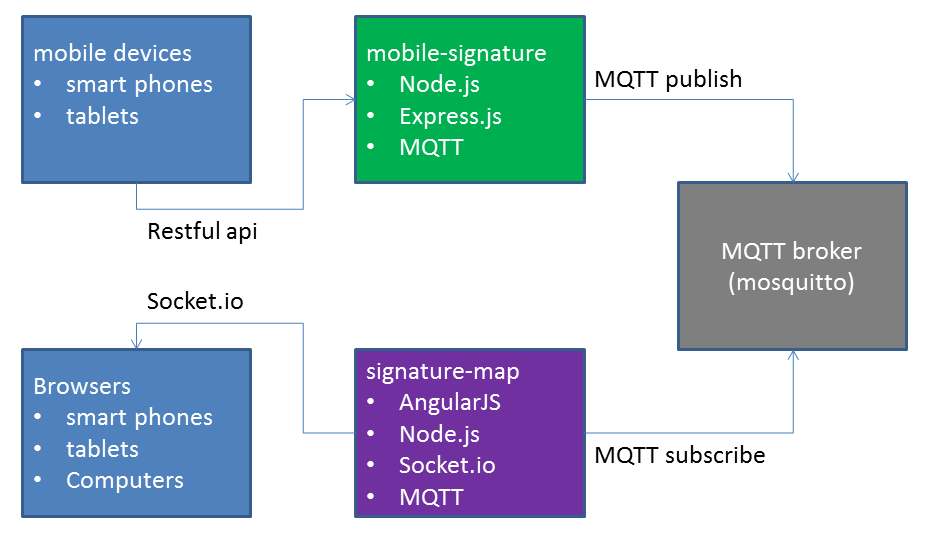

# Demo of Kubernetes on Raspberry PI

### Application Flow

### Modules
- simagix/mobile-signature
- simagix/signature-map
- mqtt broker (mosquitto or mqtt://test.mosquitto.org)

### Kubernetes
Start web apps using kubectl
```
export EXTERNAL_IP=192.168.1.2
kubectl run mosquitto --image=simagix/mosquitto-rpi --port=1883
kubectl expose rc mosquitto --port=1883 --target-port=1883 --external-ip=$EXTERNAL_IP
kubectl run mobile-signature --image=simagix/mobile-signature-rpi --port=3300 --env="MQTT_BROKER=mqtt://$EXTERNAL_IP"
kubectl expose rc mobile-signature --port=3300 --target-port=3300 --external-ip=$EXTERNAL_IP
kubectl run signature-map --image=simagix/signature-map-rpi --port=3301 --env="MQTT_BROKER=mqtt://$EXTERNAL_IP"
kubectl expose rc signature-map --port=3301 --target-port=3301 --external-ip=$EXTERNAL_IP
```

### Get Info
```
kubectl get nodes
kubectl get pods
kubectl get rc
kubectl get svc
```

### Scale
```
kubectl scale rc busybox --replicas=5
kubectl scale rc mobile-signature --replicas=1
kubectl scale rc signature-map --replicas=2
```

```
$ kubectl get pods -o wide
NAME                     READY     STATUS    RESTARTS   AGE       NODE
busybox-iown8            1/1       Running   0          1m        192.168.1.5
k8s-master-127.0.0.1     3/3       Running   6          4d        127.0.0.1
mobile-signature-zflym   1/1       Running   0          56s       192.168.1.5
signature-map-14zj2      1/1       Running   0          41s       192.168.1.5
```

### Stop Services
```
kubectl delete svc signature-map
kubectl delete rc signature-map
#kubectl delete pod signature-map-<some_id>
kubectl delete svc mobile-signature
kubectl delete rc mobile-signature
#kubectl delete pod mobile-signature-<some_id>
kubectl delete svc mosquitto
kubectl delete rc mosquitto
```

### Failover
Pull a cable from a slave
```
$ kubectl get pods -o wide
NAME                     READY     STATUS    RESTARTS   AGE       NODE
busybox-iown8            1/1       Running   0          6m        192.168.1.5
k8s-master-127.0.0.1     3/3       Running   6          4d        127.0.0.1
mobile-signature-zflym   1/1       Running   0          6m        192.168.1.5
signature-map-14zj2      1/1       Running   0          6m        192.168.1.5
```
Wait about 2 minutes
```
$ kubectl get pods -o wide
NAME                     READY     STATUS    RESTARTS   AGE       NODE
busybox-8ecog            1/1       Running   0          3m        127.0.0.1
k8s-master-127.0.0.1     3/3       Running   6          4d        127.0.0.1
mobile-signature-ctswr   1/1       Running   0          3m        127.0.0.1
signature-map-3l1zj      1/1       Running   0          3m        127.0.0.1
```

### Docker
Start web apps using docker command.
```
docker run -p 3300:3300 -it -e MQTT_BROKER=mqtt://192.168.1.2 simagix/mobile-signature-rpi
docker run -p 3301:3301 -it -e MQTT_BROKER=mqtt://192.168.1.2 simagix/signature-map-rpi
```
